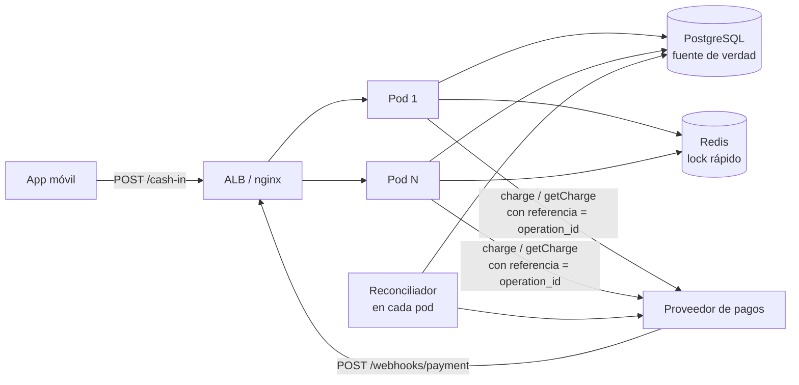
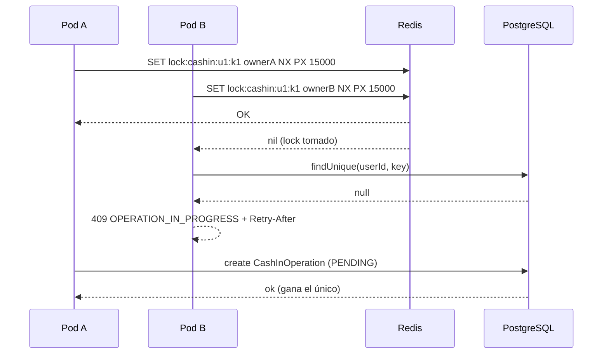
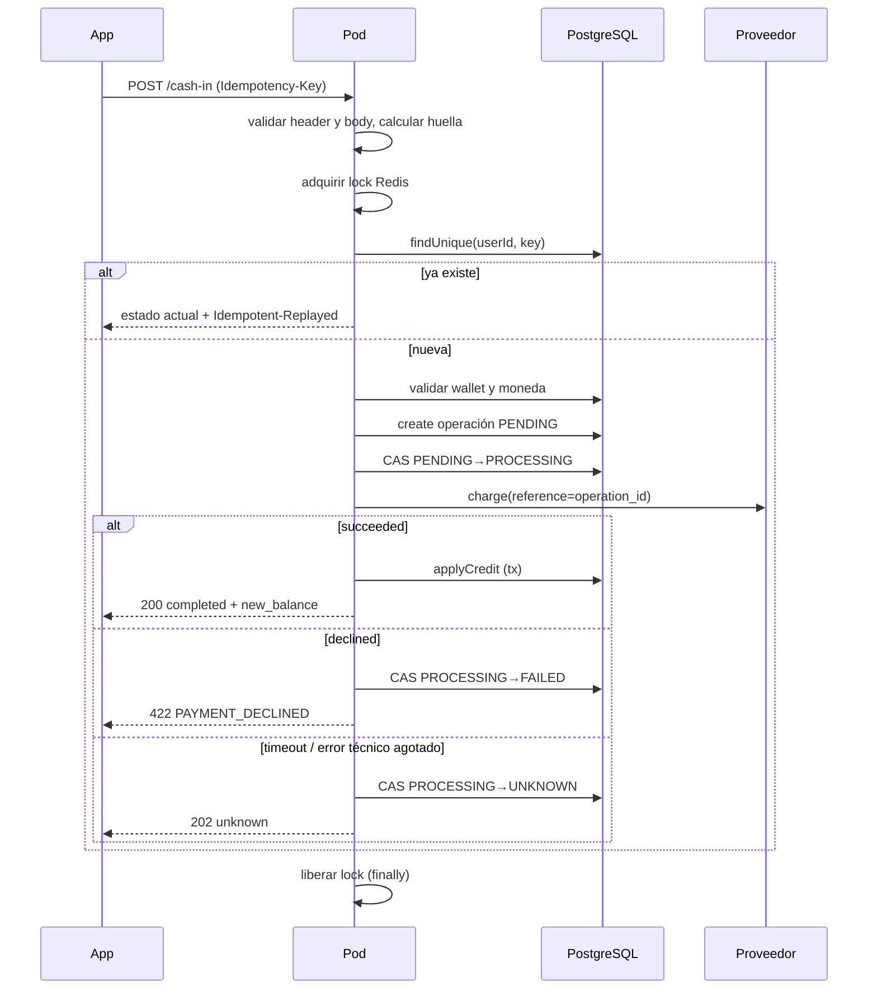
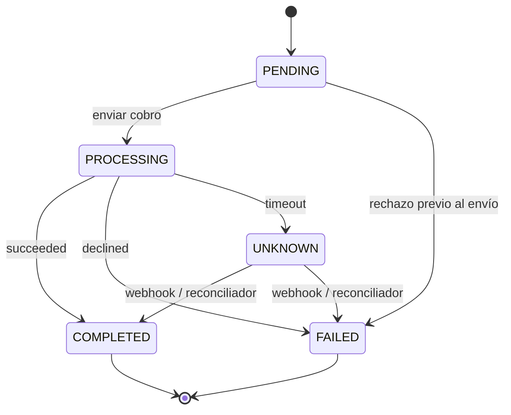

# Design · Wallet Cash-In

> Cómo se cumplen los requisitos de [requirements.md](requirements.md). Cada sección cita los requisitos que cubre.

## 1. Arquitectura



Stack: Bun, Hono, Prisma, PostgreSQL 16, Redis 7, `bun:test`, Docker Compose, Terraform sobre AWS.

### Organización Feature-First

El código se agrupa por feature. Cada feature contiene sus rutas, schemas, servicio, repositorio y tests. Las reglas de dependencia y la convención de nombres están en [AGENTS.md](../../AGENTS.md#estructura-feature-first).

| Carpeta | Contenido |
|---|---|
| `src/features/cash-in/` | `POST /cash-in`, schemas zod, servicio, repositorio de operaciones, huella del request. |
| `src/features/webhooks/` | `POST /webhooks/payment`, schema del evento, firma HMAC, dedupe y aplicación del evento. |
| `src/features/wallet/` | `applyCredit`, `getWallet`, ledger y repositorio de wallets. |
| `src/features/reconciliation/` | Reconciliador con lease. |
| `src/features/health/` | `GET /health`. |
| `src/shared/` | `AppError`, catálogo, error handler, política de retry, utilidades de dinero y máquina de estados de la operación. |
| `src/infra/` | Config, cliente Prisma, cliente Redis, lock, logger, correlation ID, adaptadores de `payment-provider/`. |
| `tools/mock-psp/` | Proveedor falso como servicio HTTP para e2e. |

Dentro de cada feature se mantiene la separación de responsabilidades:

| Archivo | Responsabilidad |
|---|---|
| `<feature>.routes.ts` | Validación zod de headers y body, mapeo de estado a código HTTP. |
| `<feature>.schemas.ts` | Schemas zod y tipos derivados. |
| `<feature>.service.ts` | Orquesta lock, operación, proveedor y abono. |
| `<feature>.repository.ts` | Acceso a datos solo con cliente Prisma. |

El proveedor se accede por el puerto `PaymentProvider`. Hay dos adaptadores:
- `FakePaymentProvider` en memoria, para tests unitarios y de integración.
- `HttpPaymentProvider`, que habla con el servicio `mock-psp` de Docker Compose en e2e.

El `mock-psp` es un contenedor aparte a propósito. Si el proveedor falso viviera en memoria de cada pod, dos réplicas no compartirían sus cobros y la idempotencia por referencia no se podría probar entre pods.

## 2. Idempotencia en dos capas · R2, R3, R4



**Capa 1, Redis.** `SET lock:cashin:{userId}:{key} <ownerId> NX PX <ttl>`.
- `ownerId` es un UUID aleatorio por request. Identifica al dueño del lock, no tiene relación con dinero.
- Al liberar, un script Lua borra la key solo si el valor sigue siendo el `ownerId` propio. Así un pod cuyo lock expiró no borra el de otro.
- El TTL es mayor que el timeout del proveedor por todos sus reintentos, más margen.
- Si Redis falla, se registra un warning y se continúa sin lock. La capa 2 sigue garantizando la corrección.

**Capa 2, PostgreSQL.** `@@unique([userId, idempotencyKey])` en `CashInOperation`.
- `prisma.cashInOperation.create` lo gana un solo pod.
- El perdedor recibe `P2002`, hace `findUnique` y responde como replay.
- Esta capa cubre lo que Redis no puede: lock expirado, Redis caído, failover de Redis.

**Huella.** `requestHash = sha256(JSON canónico de {user_id, amount, currency, payment_method})`.
- `amount` se normaliza a string con 2 decimales, así `100` y `100.00` dan la misma huella.
- Las keys del objeto se ordenan antes de serializar.

**Por qué no solo Redis.** Un lock con TTL no es una garantía de exclusión: puede expirar durante una pausa de GC o una llamada lenta, y una réplica de Redis puede perder escrituras en un failover. Redis evita trabajo duplicado en el caso común. La restricción única es la garantía.

**Por qué no solo PostgreSQL.** Sería correcto. Redis se agrega porque el usuario lo pidió y porque responde el doble click sin tocar la DB ni abrir transacciones.

## 3. Flujo de `POST /cash-in` · R1, R5, R6



Detalles:
- Wallet y moneda se validan antes de crear la operación. Esos errores son deterministas, así que repetirlos en cada retry es seguro.
- Si un CAS devuelve `count = 0`, otro actor, normalmente el webhook, ya movió la operación. El pod relee y responde el estado real.
- El lock se libera siempre en `finally`.

### Respuesta a la pregunta central

> El proveedor cobra S/100, hay timeout, no sabes si cobró, el cliente reintenta.

1. La operación ya existe en DB con su `operation_id` antes de llamar al proveedor.
2. El cobro se envió con `reference = operation_id` como idempotency key del proveedor.
3. El timeout deja la operación `UNKNOWN` y responde `202`. No se cobra de nuevo.
4. El retry del cliente con la misma key encuentra la operación y devuelve su estado actual.
5. La operación se resuelve sola: por el webhook `charge.succeeded`, o por el reconciliador que hace `getCharge(reference)`.
6. Si hace falta reenviar el cobro, se reenvía con la misma referencia, y el proveedor devuelve el cargo existente en lugar de crear otro.

La única forma de cobrar dos veces sería generar una referencia nueva para la misma intención, y el diseño nunca lo hace.

## 4. Máquina de estados · R7



- `src/shared/operation-state-machine.ts` es puro: `canTransition(from, to)` y `allowedSources(to)`. Vive en `shared/` porque lo usan cash-in, webhooks y el reconciliador.
- Una feature importa de otra solo a través de su `<feature>.service.ts`.
- Toda transición en DB es un compare-and-set:

```ts
const { count } = await tx.cashInOperation.updateMany({
  where: { id, status: { in: allowedSources("COMPLETED") } },
  data: { status: "COMPLETED", completedAt: new Date() },
});
if (count === 0) { /* otro actor ganó: releer y decidir */ }
```

- `PROCESSING` y `UNKNOWN` no son terminales: un webhook o el reconciliador las cierran.
- No existe transición desde `COMPLETED` ni desde `FAILED`.

## 5. Abono y race conditions · R8

`applyCredit({ operationId, providerChargeId, actor }, tx?)`, en `src/features/wallet/wallet.service.ts`, es la única función que acredita. La usan el flujo síncrono, el webhook y el reconciliador.

- Si recibe `tx`, trabaja dentro de esa transacción y no abre otra. El webhook la usa así, dentro de su propia transacción.
- Devuelve `{ applied, from, balanceAfter }`. `applied` es `false` cuando la operación ya era terminal, `from` es el estado de origen para el log de transición y `balanceAfter` sale del asiento.
- `actor` es `api`, `webhook` o `reconciler`.
- `applyCredit` no loguea. Con un `tx` externo, un rollback posterior haría mentir al log. Quien llama registra la transición después del commit con `from` y el mismo `actor`.
- Si `applied` es `false`, `from` es el estado leído. `balanceAfter` es el del asiento existente si la operación ya está `COMPLETED`, o `null` si no.
- `userId` y `amount` se leen de la operación dentro de la misma transacción.
- `getWallet(userId)` del mismo servicio es la única forma en que cash-in lee una wallet.

```ts
await prisma.$transaction(async (tx) => {
  const { count } = await tx.cashInOperation.updateMany({
    where: { id: operationId, status: { in: ["PROCESSING", "UNKNOWN"] } },
    data: { status: "COMPLETED", providerChargeId, completedAt: new Date() },
  });
  if (count === 0) return; // ya terminal: no-op idempotente
  const wallet = await tx.wallet.update({
    where: { userId },
    data: { balance: { increment: amount } },
  });
  await tx.ledgerEntry.create({
    data: { walletId: wallet.id, operationId, type: "CREDIT", amount, balanceAfter: wallet.balance },
  });
});
```

- El `increment` de Prisma genera una sola sentencia `balance = balance + x`. Nunca se lee el saldo para escribirlo luego.
- El `UPDATE` de la wallet toma el lock de fila hasta el commit. Dos abonos concurrentes del mismo usuario se serializan en esa fila y `balanceAfter` es exacto.
- `LedgerEntry.operationId @unique` es la última red: aunque falle todo lo demás, un segundo asiento rompe la transacción y nada se acredita dos veces.
- `new_balance` en la respuesta sale de `LedgerEntry.balanceAfter`. Por eso es el mismo en cada replay.

## 6. Webhooks · R9

### Contrato del proveedor

```
POST /webhooks/payment
X-Provider-Signature: t=1727890000,v1=<hex(HMAC_SHA256(secret, t + "." + rawBody))>
Content-Type: application/json
```

```json
{
  "event_id": "evt_01J...",
  "type": "charge.succeeded",
  "created_at": "2026-10-02T15:04:05Z",
  "data": {
    "charge_id": "ch_123",
    "reference": "op_9f8e7d",
    "amount": 100.00,
    "currency": "PEN",
    "failure_code": null
  }
}
```

Tipos: `charge.succeeded`, `charge.failed`, `charge.pending`.

Respuesta: `200 { "received": true, "duplicate": false }`.

### Procesamiento

1. Verificar la firma sobre el body crudo con comparación en tiempo constante. Tolerancia de timestamp configurable, 5 minutos por defecto. Luego validar el payload con `webhookEventSchema` de zod.
2. En una sola transacción:
   1. `tx.webhookEvent.create({ providerEventId: event_id, ... })`. Si da `P2002`, es duplicado: responder `200 duplicate: true`.
   2. Buscar la operación por `reference`. Si no existe, guardar el evento como huérfano y responder `200`. No puede ser una carrera, porque la operación se persiste antes de llamar al proveedor.
   3. Validar monto y moneda. Si no coinciden, registrar la anomalía y no acreditar.
   4. Aplicar la transición: `succeeded` usa la lógica de `applyCredit`, `failed` hace CAS a `FAILED`, `pending` no cambia estado.
   5. Si la transición no es válida desde el estado actual, se registra `outcome = "IGNORED_OUT_OF_ORDER"` y se responde `200`.
   6. Marcar `processedAt` y `outcome` en el evento.

Valores de `outcome`:

| outcome | Cuándo |
|---|---|
| `APPLIED` | El evento cambió el estado de la operación. |
| `NOOP_ALREADY_APPLIED` | La operación ya estaba en el estado que pide el evento. |
| `IGNORED_OUT_OF_ORDER` | La transición no es válida desde el estado actual. |
| `ORPHAN` | No existe una operación con esa referencia. |
| `AMOUNT_MISMATCH` | Monto o moneda no coinciden con la operación. |
| `PENDING_NO_CHANGE` | Evento `charge.pending`, que no cambia estado. |
3. Si la transacción falla por un error transitorio, el insert del evento se revierte y se responde `5xx`. El reintento del proveedor lo procesa de cero.

El punto 3 es clave: si el evento se marcara como visto fuera de la transacción del efecto, un fallo intermedio haría que el reintento se descartara como duplicado y el abono se perdería.

### Orden de llegada

| Estado actual | `succeeded` | `failed` | `pending` |
|---|---|---|---|
| PROCESSING | COMPLETED + abono | FAILED | sin cambio |
| UNKNOWN | COMPLETED + abono | FAILED | sin cambio |
| PENDING | ignorado, anomalía | FAILED | sin cambio |
| COMPLETED | no-op | ignorado, anomalía | ignorado |
| FAILED | ignorado, anomalía crítica | no-op | ignorado |

Un `succeeded` sobre `FAILED` significa que el cliente pagó y no recibió saldo. Se registra con nivel `error` para revisión manual o reembolso, nunca se acredita en automático.

### Webhook antes que la respuesta del API · R9.8

El webhook llega mientras el pod sigue esperando al proveedor. El webhook ejecuta `applyCredit` y la operación queda `COMPLETED`. Cuando el flujo síncrono recibe la respuesta, su CAS devuelve `count = 0`, relee la operación y responde `200 completed` con el `balanceAfter` del asiento.

## 7. Retry y resiliencia · R6, R10, R11

### Hacia el proveedor

| Resultado | Acción |
|---|---|
| `succeeded` | Acreditar. |
| `declined` | `FAILED`. Sin reintento. |
| Error de conexión antes de enviar | Reintento con la misma referencia. |
| `5xx` del proveedor | Reintento con la misma referencia. |
| Timeout | Sin reintento en línea. `UNKNOWN` y lo resuelve el reconciliador. |

Backoff: `min(cap, base * 2^intento)` con full jitter. Valores por defecto: base 100 ms, cap 1 s, máximo 2 reintentos, timeout por llamada 3 s.

El timeout no se reintenta en línea para no alargar el request de la app. Reintentar con la misma referencia sería seguro, pero el reconciliador lo hace sin bloquear al usuario.

### Hacia PostgreSQL

`withDbRetry(fn)` reintenta la unidad de trabajo ante errores transitorios: `P1001`, `P1002`, `P1008`, `P1017`, `P2024` y `P2034`. Máximo 3 intentos con backoff. Al agotarse, lanza `SERVICE_UNAVAILABLE`. Cada unidad es idempotente, así que reintentarla no duplica efectos.

Con `@prisma/adapter-pg`, una caída real de PostgreSQL no llega con esos códigos. Se verificó a mano en T4.4:

| Caso | Error que llega |
|---|---|
| Puerto cerrado | `PrismaClientKnownRequestError` con `code: "ECONNREFUSED"` |
| Host que no responde | `Error` del pool de `pg`: `Connection terminated due to connection timeout` |
| Conexión cortada con el pool abierto | El pool reconecta solo y la consulta no falla |

Por eso también son transitorios los códigos de red `ECONNREFUSED`, `ECONNRESET`, `ETIMEDOUT` y `EPIPE` en `code`, y los errores del pool `Connection terminated due to connection timeout`, `Connection terminated unexpectedly` y `timeout exceeded when trying to connect`, que solo se reconocen por el mensaje. Una credencial inválida (`P1000`) no es transitoria.

### Reconciliador · R10

Corre en cada pod con un intervalo configurable.

1. Busca operaciones `PENDING`, `PROCESSING` o `UNKNOWN` con `updatedAt` más viejo que el umbral, 30 s por defecto, y con `reconcileAttempts` menor que `RECONCILE_MAX_ATTEMPTS`.
2. Reclama cada una con un lease:

```ts
const { count } = await prisma.cashInOperation.updateMany({
  where: {
    id,
    status: { in: ["PENDING", "PROCESSING", "UNKNOWN"] },
    OR: [{ leaseUntil: null }, { leaseUntil: { lt: now } }],
  },
  data: { leaseOwner: podId, leaseUntil: addSeconds(now, 60), reconcileAttempts: { increment: 1 } },
});
```

3. Solo el pod con `count = 1` la procesa.
4. Si la operación está `PENDING`, el cobro nunca salió: la pasa a `PROCESSING` con CAS y envía `charge` con la misma referencia. Así se completa la intención del usuario tras una caída entre el `create` y el envío.
5. Si está `PROCESSING` o `UNKNOWN`, llama `getCharge(reference)`:
   - `succeeded`: `applyCredit`.
   - `declined`: CAS a `FAILED`.
   - `not_found`: reenvía `charge` con la misma referencia. Esto cubre un reinicio justo después de pasar a `PROCESSING` y antes de que el cobro saliera.
   - Error: libera el lease y reintenta en el siguiente ciclo.
6. Al llegar a `RECONCILE_MAX_ATTEMPTS` intentos, deja la operación `UNKNOWN`, emite un log `error` con `event: "reconcile.exhausted"` y no la vuelve a tomar. Queda para revisión manual.

## 8. Contrato HTTP

### `POST /cash-in`

Headers: `Idempotency-Key` (UUID, obligatorio) y `X-Request-Id` (opcional).

Request:

```json
{ "user_id": "usr_abc123", "amount": 100.00, "currency": "PEN", "payment_method": "card_xyz" }
```

Respuesta `200`:

```json
{ "operation_id": "op_9f8e7d", "status": "completed", "amount": 100.00, "new_balance": 350.00 }
```

Respuesta `202`, en curso o incierta:

```json
{ "operation_id": "op_9f8e7d", "status": "unknown", "amount": 100.00 }
```

| Estado | Código |
|---|---|
| `completed` | 200 |
| `pending`, `processing`, `unknown` | 202 |
| `failed` | 422 `PAYMENT_DECLINED` |

Toda respuesta de una key ya existente con la misma huella lleva `Idempotent-Replayed: true`. El `422 IDEMPOTENCY_KEY_REUSED` no lo lleva, porque un body distinto no es un replay. Toda respuesta lleva `X-Request-Id`.

Los montos se guardan como `Decimal(18,2)` y se calculan con Decimal. En JSON se emiten como número, como pide el contrato del PDF.

### Validación con zod · R1.3 a R1.6, R2.1, R2.2, R9.3

Los schemas viven en `src/features/<feature>/<feature>.schemas.ts` y son la única definición de cada contrato de entrada. Los tipos TypeScript se derivan con `z.infer`, sin duplicarlos a mano.

```ts
// API de zod 4
export const idempotencyKeySchema = z.uuid({
  error: (issue) =>
    issue.input === undefined ? "IDEMPOTENCY_KEY_MISSING" : "IDEMPOTENCY_KEY_INVALID",
});

// El tope llega como parámetro. El schema no importa una config cargada a nivel de módulo.
export const createCashInRequestSchema = (maxAmount: number) => z
  .object({
    user_id: z.string().trim().min(1).max(64),
    amount: z
      .number()
      .positive()
      .max(maxAmount)
      .refine((v) => /^\d+(\.\d{1,2})?$/.test(String(v)), "Máximo 2 decimales"),
    currency: z.literal("PEN", { error: "Solo se acepta PEN" }),
    payment_method: z.string().trim().min(1).max(64),
  })
  .strict();

export type CashInRequest = z.infer<ReturnType<typeof createCashInRequestSchema>>;
```

Integración con Hono:
- Se usa `@hono/zod-validator` con un hook propio que convierte el fallo en `AppError`. Ninguna ruta arma el error a mano.
- Orden: primero `zValidator("header", ...)` para `Idempotency-Key`, luego `zValidator("json", cashInRequestSchema, ...)`. Un request sin key falla por la key aunque el body también sea inválido.
- El fallo del header se mapea a `IDEMPOTENCY_KEY_MISSING` o `IDEMPOTENCY_KEY_INVALID`. El fallo del body se mapea a `VALIDATION_ERROR`.
- Un body que no es JSON también responde `VALIDATION_ERROR`.
- Cada `issue` de zod se traduce a `{ "field": issue.path.join("."), "message": issue.message }` en el campo `errors`.
- `.strict()` rechaza campos desconocidos. En una API de dinero es mejor fallar ante un campo inesperado, por ejemplo un typo como `ammount`, que ignorarlo en silencio. Además deja la huella del request estable.
- El payload del webhook no usa `.strict()`: descarta campos desconocidos. Si el proveedor agrega un campo, un `400` provocaría reintentos infinitos de su lado.
- La validación ocurre antes del lock Redis, de la DB y del proveedor. Un request inválido no tiene efectos.

Ejemplo de respuesta:

```json
{
  "type": "https://errors.ligo.pe/cash-in/validation-error",
  "title": "Request inválido",
  "status": 400,
  "code": "VALIDATION_ERROR",
  "detail": "El body no cumple el contrato de POST /cash-in.",
  "request_id": "b3c1e2a0-6f1d-4a57-9d51-2f4f0a1c9e77",
  "retryable": false,
  "errors": [
    { "field": "amount", "message": "Máximo 2 decimales" },
    { "field": "currency", "message": "Solo se acepta PEN" }
  ]
}
```

En el webhook la firma se verifica sobre el body crudo antes de parsear. Recién después se valida el payload con `webhookEventSchema`. Así no se gasta trabajo en payloads no firmados y la firma se calcula sobre los bytes exactos recibidos.

`src/infra/config.ts` también usa zod para validar las variables de entorno al arrancar. Si falta una, el proceso no levanta.

### `GET /health`

Responde `200` si PostgreSQL responde. Informa Redis como degradado sin fallar.

## 9. Formato de error · R12

Todos los errores usan RFC 9457 Problem Details con `Content-Type: application/problem+json`. Un error handler global de Hono lo construye. Ninguna ruta arma su propio JSON de error.

```json
{
  "type": "https://errors.ligo.pe/cash-in/idempotency-key-reused",
  "title": "Idempotency-Key reutilizada con otro payload",
  "status": 422,
  "code": "IDEMPOTENCY_KEY_REUSED",
  "detail": "La key ya fue usada con un body distinto.",
  "request_id": "b3c1e2a0-6f1d-4a57-9d51-2f4f0a1c9e77",
  "operation_id": "op_9f8e7d",
  "retryable": false,
  "errors": []
}
```

| Campo | Regla |
|---|---|
| `type` | URI estable por código: `https://errors.ligo.pe/cash-in/<code-en-kebab>`. |
| `title` | Resumen fijo por código, para humanos. |
| `status` | Igual al status HTTP. |
| `code` | Estable. El cliente decide con este campo. |
| `detail` | Explicación de esta ocurrencia, sin datos internos. |
| `request_id` | El correlation ID de la respuesta. |
| `operation_id` | Solo si ya existe una operación. |
| `retryable` | `true` si reintentar con la misma key es seguro y puede cambiar el resultado. |
| `errors` | En `VALIDATION_ERROR`: lista de `{ "field": "amount", "message": "..." }`. Vacío en el resto. |

Nunca se exponen stack traces ni mensajes crudos del proveedor o de Prisma. Esos van solo a los logs, ligados por `request_id`.

### Catálogo

| code | status | retryable | Cuándo |
|---|---|---|---|
| `VALIDATION_ERROR` | 400 | false | Body inválido. |
| `IDEMPOTENCY_KEY_MISSING` | 400 | false | Falta el header. |
| `IDEMPOTENCY_KEY_INVALID` | 400 | false | El header no es UUID. |
| `WEBHOOK_SIGNATURE_INVALID` | 401 | false | Firma inválida o timestamp fuera de tolerancia. |
| `WALLET_NOT_FOUND` | 404 | false | El usuario no tiene wallet. |
| `OPERATION_IN_PROGRESS` | 409 | true | Otro request tiene el lock y la operación aún no existe. Lleva `Retry-After: 1`. |
| `IDEMPOTENCY_KEY_REUSED` | 422 | false | Misma key con body distinto. |
| `CURRENCY_MISMATCH` | 422 | false | La moneda no coincide con la wallet. |
| `PAYMENT_DECLINED` | 422 | false | El proveedor rechazó el cobro. Lleva `operation_id`. |
| `NOT_FOUND` | 404 | false | La ruta no existe. |
| `INTERNAL_ERROR` | 500 | true | Error inesperado. |
| `SERVICE_UNAVAILABLE` | 503 | true | DB no disponible tras reintentos. Lleva `Retry-After: 2`. |

Implementación: `src/shared/errors.ts` define `AppError` y el catálogo. `src/shared/error-handler.ts` traduce `AppError`, errores de validación y errores desconocidos. El `HTTPException` 400 que Hono lanza ante un body que no es JSON sale como `VALIDATION_ERROR`. Una ruta inexistente sale como `NOT_FOUND` desde `app.notFound`.

## 10. Modelo de datos · R8, R14

```prisma
enum OperationStatus { PENDING PROCESSING UNKNOWN COMPLETED FAILED }
enum LedgerEntryType { CREDIT }

model Wallet {
  id        String        @id @default(uuid())
  userId    String        @unique
  currency  String        @db.Char(3)
  balance   Decimal       @db.Decimal(18, 2) @default(0)
  createdAt DateTime      @default(now())
  updatedAt DateTime      @updatedAt
  entries   LedgerEntry[]
}

model CashInOperation {
  id                String          @id            // op_<uuidv7 sin guiones>, generado por la app
  userId            String
  idempotencyKey    String          @db.Uuid
  requestHash       String          @db.Char(64)
  amount            Decimal         @db.Decimal(18, 2)
  currency          String          @db.Char(3)
  paymentMethod     String
  status            OperationStatus @default(PENDING)
  providerChargeId  String?         @unique
  failureCode       String?
  lastError         String?
  reconcileAttempts Int             @default(0)
  leaseOwner        String?
  leaseUntil        DateTime?
  createdAt         DateTime        @default(now())
  updatedAt         DateTime        @updatedAt
  completedAt       DateTime?
  ledgerEntry       LedgerEntry?
  webhookEvents     WebhookEvent[]

  @@unique([userId, idempotencyKey])
  @@index([status, updatedAt])
}

model LedgerEntry {
  id           String          @id @default(uuid())
  walletId     String
  operationId  String          @unique
  type         LedgerEntryType
  amount       Decimal         @db.Decimal(18, 2)
  balanceAfter Decimal         @db.Decimal(18, 2)
  createdAt    DateTime        @default(now())
  wallet       Wallet          @relation(fields: [walletId], references: [id])
  operation    CashInOperation @relation(fields: [operationId], references: [id])
}

model WebhookEvent {
  id              String           @id @default(uuid())
  providerEventId String           @unique
  type            String
  operationId     String?
  payload         Json
  outcome         String?
  receivedAt      DateTime         @default(now())
  processedAt     DateTime?
  operation       CashInOperation? @relation(fields: [operationId], references: [id])
}
```

Restricciones que sostienen la corrección:

| Restricción | Protege contra |
|---|---|
| `CashInOperation @@unique([userId, idempotencyKey])` | Doble operación por la misma intención. |
| `LedgerEntry.operationId @unique` | Doble abono. |
| `WebhookEvent.providerEventId @unique` | Webhook procesado dos veces. |
| `CashInOperation.providerChargeId @unique` | Un cargo asociado a dos operaciones. |

Acceso a datos: solo cliente Prisma y Prisma Migrate. Sin `$queryRaw` ni `$executeRaw`.

## 11. Proveedor de pagos

```ts
interface PaymentProvider {
  charge(input: { reference: string; amount: string; currency: string; paymentMethod: string; requestId: string }): Promise<ChargeResult>;
  getCharge(reference: string): Promise<ChargeResult | { status: "not_found" }>;
}
type ChargeResult =
  | { status: "succeeded"; chargeId: string }
  | { status: "declined"; chargeId: string; failureCode: string };
// Timeouts y errores técnicos se lanzan como ProviderTimeoutError o ProviderUnavailableError.
// Una respuesta que no encaja en el contrato se lanza como ProviderUnexpectedError.
```

Escenarios del proveedor falso, elegidos por `payment_method`:

| `payment_method` | Comportamiento |
|---|---|
| `card_ok` o cualquier otro | Cobra y responde `succeeded`. |
| `card_declined` | Responde `declined` con `insufficient_funds`. |
| `card_timeout` | Registra el cobro y no responde antes del timeout. Luego emite `charge.succeeded`. |
| `card_flaky` | Falla con `503` la primera vez para cada referencia y luego cobra. Prueba el retry con la misma referencia. |

Ambos adaptadores son idempotentes por `reference`: la misma referencia devuelve el mismo cargo.

| Error del adaptador | Acción del servicio |
|---|---|
| `ProviderUnavailableError` | Reintento técnico con la misma referencia. |
| `ProviderTimeoutError` | `UNKNOWN` sin reintento en línea. |
| `ProviderUnexpectedError` | `UNKNOWN` sin reintento. Nunca `FAILED` sin certeza. Lo resuelve el reconciliador. |

### Contrato HTTP del `mock-psp`

| Request | Respuesta |
|---|---|
| `POST /charges` con `{ reference, amount, currency, payment_method }` | `200 { status: "succeeded", charge_id }` o `200 { status: "declined", charge_id, failure_code }` |
| `GET /charges/:reference` | `200` con el mismo cuerpo, o `404` si no conoce la referencia. |
| `GET /__admin/charges/:reference` | `200 { charge, attempts }`. Solo para e2e. |

Un rechazo es un resultado de negocio y va como `200` con `status: "declined"`, nunca como 4xx. El `HttpPaymentProvider` valida cada respuesta con zod.

## 12. Observabilidad · R13

- Middleware de correlation ID: usa `X-Request-Id` si viene, si no genera un UUID. Lo devuelve en la respuesta, lo guarda en el contexto de Hono y lo propaga al proveedor.
- Logger pino en JSON con un child logger por request que lleva `request_id`.
- Cada transición registra `{ event: "operation.transition", operation_id, from, to, actor }`, donde `actor` es `api`, `webhook` o `reconciler`.
- Anomalías con `event: "webhook.anomaly"` y nivel `warn` o `error`.

## 13. Configuración

| Variable | Defecto | Uso |
|---|---|---|
| `DATABASE_URL` | — | PostgreSQL. |
| `REDIS_URL` | — | Redis. |
| `WEBHOOK_SECRET` | — | HMAC de webhooks. |
| `PROVIDER_MODE` | `fake` | `fake` o `http`. |
| `PROVIDER_BASE_URL` | — | URL del `mock-psp` en modo `http`. |
| `PROVIDER_TIMEOUT_MS` | 3000 | Timeout por llamada. |
| `PROVIDER_MAX_RETRIES` | 2 | Reintentos técnicos. |
| `LOCK_TTL_MS` | 15000 | TTL del lock Redis. |
| `CASH_IN_MAX_AMOUNT` | 10000 | Tope por operación. |
| `RECONCILE_INTERVAL_MS` | 10000 | Ciclo del reconciliador. |
| `RECONCILE_STALE_MS` | 30000 | Antigüedad mínima para reconciliar. |
| `RECONCILE_MAX_ATTEMPTS` | 5 | Intentos antes de alerta. |
| `WEBHOOK_TOLERANCE_S` | 300 | Tolerancia del timestamp. |

El TTL del lock cubre el peor caso del request: 3 intentos de 3 s más backoff, con margen.

## 14. Infraestructura

**Local, Docker Compose:**
- `postgres` y `redis` siempre.
- Perfil `e2e`: `app1`, `app2`, `nginx` en round robin y `mock-psp`.
- Los tests e2e verifican estado, asientos y eventos leyendo PostgreSQL con Prisma. No hay endpoint de consulta de operaciones.

**AWS, Terraform en `infra/terraform`:**
- VPC con subredes públicas y privadas.
- ALB público hacia un servicio ECS Fargate con 2 o más tareas.
- RDS PostgreSQL y ElastiCache Redis en subredes privadas.
- Secrets Manager para `DATABASE_URL` y `WEBHOOK_SECRET`.
- CloudWatch Logs.
- Solo `fmt` y `validate`. No se ejecuta `apply`.

## 15. Escala a 1M operaciones por día

Un millón por día son unas 12 por segundo en promedio y quizás 100 en picos. El diseño aguanta eso sin cambios estructurales. Lo que cambiaría:
- Particionar `CashInOperation` y `WebhookEvent` por fecha y archivar.
- Sacar el reconciliador a un worker dedicado con cola, en lugar de correr en cada pod.
- Encolar webhooks (SQS) y responder 200 tras persistirlos, procesando de forma asíncrona.
- Outbox para eventos de dominio hacia otros servicios.
- PgBouncer frente a RDS y réplicas de lectura para consultas.
- TTL o limpieza de keys de idempotencia viejas, por ejemplo 24 a 72 horas.

## 16. Redis vs base de datos para idempotencia

| Criterio | Redis | PostgreSQL |
|---|---|---|
| Latencia | Sub-milisegundo | Milisegundos |
| Garantía | Lock con TTL, puede expirar o perderse en failover | Restricción única transaccional |
| Atomicidad con el abono | No | Sí, misma transacción |
| Cuándo usarlo | Barrera rápida, rate limiting, datos efímeros | Fuente de verdad para dinero |

Conclusión: en operaciones financieras la garantía va en la base de datos que guarda el dinero. Redis es una optimización.
